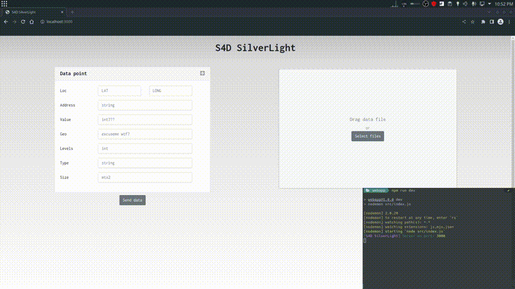

# S4D SilverLight

## Todo:
- [ ] Create sessioning system for multiple connections.
- [ ] Create data results front end.
- [ ] Validate data entry.
- [ ] Add backend (TF Serving).

---

## Usage

The **SilverLight WebApp** recieves a number of `.cvs` files and/or a series of individual *Data points* that will be forwarded to the **TF SilverLigth S4D** endPoint for inference using a "to-be-decided" model.



## Function

The server will store in session memory an `Object` with the file and entry id's as keys that point to arrays of objects or individual objects in the form of 

```js
{
        loc: String,
        address: String,
        value: String,
        geo: String,
        levels: String,
        type: String,
        size: String
}
```
that will be parsed to json for forwarding to the **TF SilverLigth-S4D** endPoint. 

For example, the actions shown above will generate the following `.json` file (cvs at `dataGen/sample_data/smol.csv` is being used):

```json
[
    {
        "loc": "(-10.681759404036942, -71.83522100367179)",
        "address": "Calle Manuel Rodríguez 652 Piso 9\nConcón, Región de Valparaíso",
        "value": "$3573.45 USD",
        "geo": "---",
        "levels": "9",
        "type": "vivienda",
        "size": "250.41 mts2"
    },
    {
        "loc": "(-11.727435508668188, -76.29254114158167)",
        "address": "Ruta 5 Sur, km 609",
        "value": "$4079.69 USD",
        "geo": "---",
        "levels": "4",
        "type": "vivienda",
        "size": "703.36 mts2"
    },
    ...
    {
        "loc": "(-11.31, -10.54)",
        "address": "Calle inventada #35, Pais raro",
        "value": "10000.50",
        "geo": "---",
        "levels": "2",
        "type": "Casa",
        "size": "50"
    }
]
```


