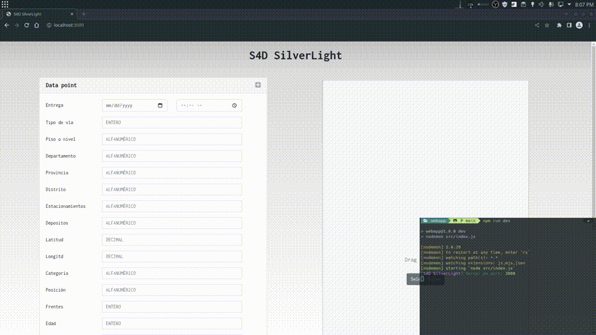
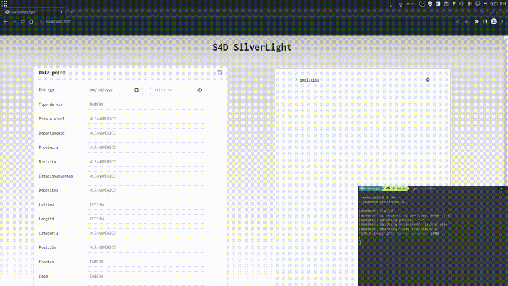
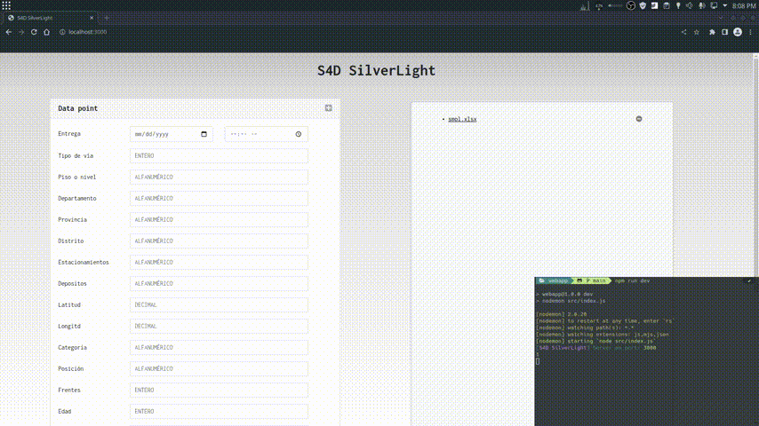

# S4D SilverLight

## Todo:
- [x] Fix `src/public/scripts/adder.js`.
- [x] Fix `src/public/scripts/dragger.js`.
- [x] Fix xlsx ``
- [x] Add xlsx serialization.
- [ ] Create data results front end.
- [ ] Validate data entry.
- [ ] Add backend (TF Serving).

---

## Usage

The **SilverLight WebApp** recieves a number of `.cvs` files and/or a series of individual *Data points* that will be forwarded to the **TF SilverLigth S4D** endPoint for inference using a "to-be-decided" model.

### Adding files



### Deleting entries



### Manual entry



### Final serialization


## Function

The server will store in session memory an `Object` with the file and entry id's as keys that point to arrays of objects or individual objects in the form of 

```js
{
    deliver : String,
    streetType : Int,
    floor : String,
    apartment : String,
    province : String,
    district : String,
    parkingNo : String,
    depositNo : String,
    loc : [Float, Float],
    category : String,
    position : String,
    fronts : Int,
    age : Int,
    elevators : Int,
    state : String,
    method : String,
    currency : String,
    lotArea : Float,
    buildArea : Float,
    value : Float
}
```
that will be parsed to json for forwarding to the **TF SilverLigth-S4D** endPoint. 

For example, the actions shown above will generate the following `.json` file (cvs at `dataGen/sample_data/smol.csv` is being used):

```json
[
    {
        "deliver": 44679.791666667,
        "streetType": 2,
        "floor": 1,
        "apartment": "Lima",
        "province": "Lima",
        "district": "Magdalena del Mar",
        "loc": "-77.023959800",
        "category": "Departamento",
        "position": "Exterior",
        "fronts": 2,
        "age": 3,
        "elevators": 1,
        "state": "Bueno",
        "method": "Comparación de mercado (directo)",
        "currency": "USD",
        "lotArea": 0,
        "buildArea": 81.56,
        "value": 120708.8
    },
    {
        "deliver": 44678.791666667,
        "streetType": 6,
        "floor": 4,
        "apartment": "Lima",
        "province": "Lima",
        "district": "San Juan de Lurigancho",
        "parkingNo": "1",
        "loc": "-76.833715000",
        "category": "Local Comercial",
        "position": "Exterior",
        "fronts": 1,
        "age": 42,
        "elevators": 2,
        "state": "Regular",
        "method": "Costos o reposición (directo)",
        "currency": "USD",
        "lotArea": 410,
        "buildArea": 0,
        "value": 192225
    },
    ...
]
```


